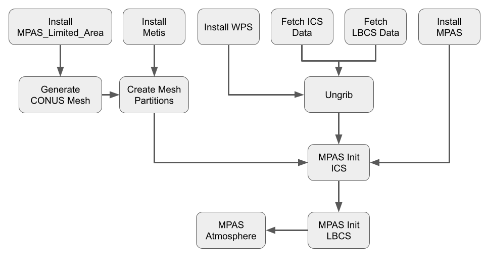

# mpas_app

App for building, configuring, and running the MPAS forecast model.

The App runs the workflow depicted below:



# Steps

1. Configure the Workflow
2. Run the Workflow

# Instructions for Configuring the workflow

- `config/default_config.yaml` is the default configuration used to run the MPAS App.

- `config/user_config.yaml` is used to override the default configuration with select customizations.

    - Edit `user_config.yaml` to set the platform, experiment directory, and model resolution, for running the forecast.

- `resources.yaml` provides platform details and contains `environment` commands, allowing users to update the default `environment`, providing flexibility to use additional modules.

# Instructions for running the MPAS App

Once `user_config.yaml` is updated with user settings, run the App:

```
cd bin
python experiment.py ../config/user_config.yaml &
```

Putting the run command in the background allows you to use the shell for monitoring workflow progress.

## Running the ungrib component

### Generation of gribfiles. 
Run the ungrib pre-processing component of the MPAS forecast model. 
MPAS App supports generation of the mesh and grid files needed to run the forecast.

Retrieve initial conditions and lateral boundary conditions automatically from AWS.
1. Retrieve `create_ics` data task that creates the MPAS initial conditions.
2. Retrieve `creat_lbcs` data task that creates the MPAS lateral boundary conditions.

## Running the MPAS Init component

Create initial conditions and lateral boundary conditions.
1. Run `create_ics` data task to generate MPAS initial conditions.
2. Run `creat_lbcs` data task to generate MPAS lateral boundary conditions.

## Running the MPAS Atmosphere component
Run the `mpas_forecast` task.

```
cd bin
python experiment.py ../config/user_config.yaml &
```

Monitor runs with `squeue` and viewing logs in experiment directory.
